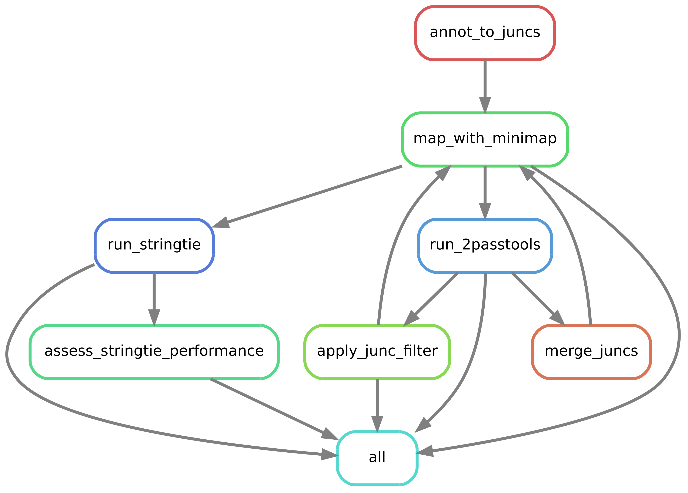
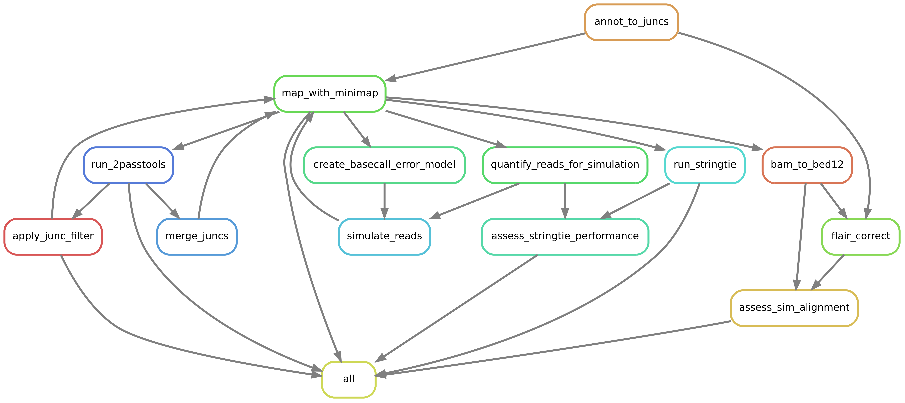

# Two pass benchmarking pipeline:

A snakemake pipeline to process the data for the two-pass alignment paper.

Workflow without read simulation:


<br>
<br>

Workflow with read simulation:



## Install and run:

Conda environments for each rule will be created automatically by snakemake. The environment yamls are in `rules/env_yamls`. If you want to use the same conda environments for all pipeline runs, rather than building them for each run, you can use the `--conda-prefix` parameter of snakemake to set a shared location for environments to be stored in.

Sometime like:

```
git clone https://github.com/bartongroup/two_pass_alignment_pipeline.git
cd two_pass_alignment_pipeline

# make snakemake environment
conda env create -f 2passpipeline.yml
conda activate 2passpipeline

# download data and annotations for e.g. Arabidopsis DRS benchmarking
cd annotations/arabidopsis
./fetch_annotations.sh
cd ../../pipeline/arabidopsis_drs
./fetch_data.sh
cd ..

# set up the conda environments required to run the pipeline
snakemake -d arabidopsis_drs \
  --use-conda \
  --create-envs-only \
  --conda-prefix <shared conda env location>

# run the pipeline on Arabidopsis DRS data, using SGE cluster
snakemake -d arabidopsis_drs \
  --use-conda \
  --conda-prefix <shared conda env location> \
  --cluster "qsub -V -cwd -pe smp {threads}" \
  -j 999
```

## Requirements:

### Before running:

* conda
* snakemake

### Installed using conda/snakemake

All of these things should be installed in their own environments by snakemake so you shouldn't have to worry about them:

For 2passtools:
* 2passtools
* python 3 (tested with 3.6)
* numpy
* scipy
* pysam
* ncls
* scikit-learn
* click
* click-log

For yanosim:
* yanosim
* python 3
* numpy
* scipy
* pysam
* click

For pipeline:
* minimap2 >= 2.17
* samtools
* stringtie >= 2.0
* bedtools
* gffcompare

To run FLAIR:
* flair
* kerneltree

## TODO:
  * Make annotation optional so pipeline can be run on organisms without annotations.